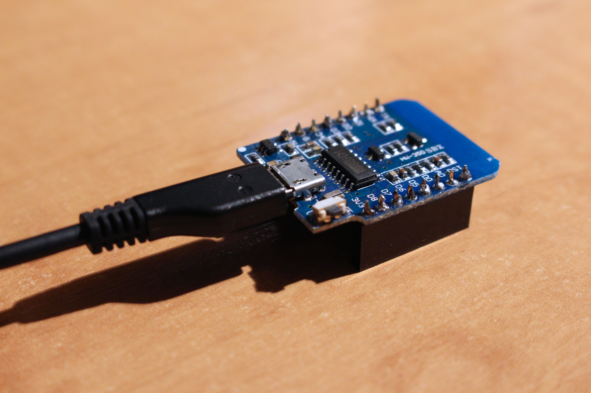

#ESP-8266 Blink

This example shows the simplest thing you can do with an ESP-8266 to see physical output: it blinks the on-board LED. We use the ESP-8266 D1 Mini by WeMos.

```
void setup() 
{
  pinMode(BUILTIN_LED, OUTPUT);
}

void loop() 
{
  digitalWrite(BUILTIN_LED, HIGH);
  delay(1000);
  digitalWrite(BUILTIN_LED, LOW);
  delay(1000);
}
```


